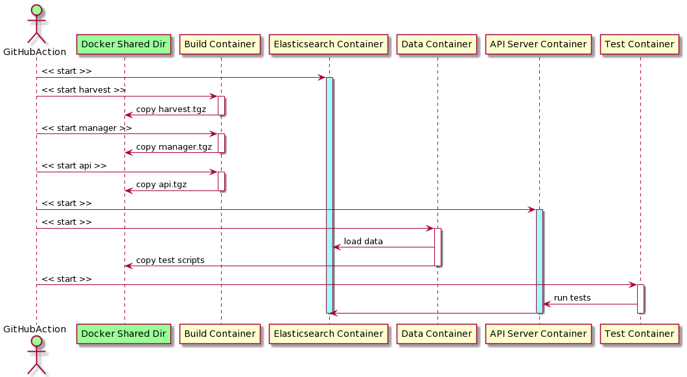

# registry-ci

Continuous Integration framework and regression tests for different Registry components, 
such as Harvest, Registry Manager and API. 

## Run CI GitHub Action

## Contributing
Pull requests are welcome. For major changes, please open an issue first to discuss what you would like to change.

Please make sure to update tests as appropriate.

## License
[APLv2](https://www.apache.org/licenses/LICENSE-2.0)
